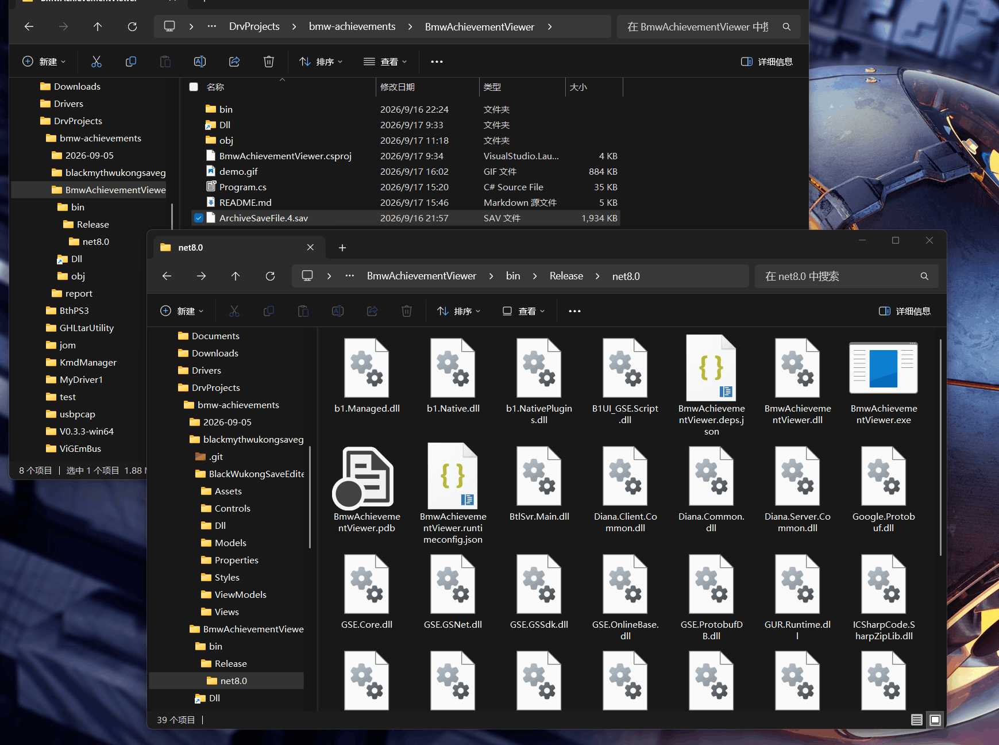

# BmwAchievementViewer

黑神话：悟空（Black Myth: Wukong）存档成就查看器。

直接解析游戏 `.sav` 存档文件，读取内置的全部 180 条成就数据（其中 81 条为 Steam「八十一难」成就），以控制台文本和自包含的 HTML 报表两种形式展示。

>注：本项目(包括本文档)完全由AI生成

# Dongmei6661的[仓库](https://github.com/Dongmei6661/black-myth-wukong-achievement-tracker/tree/feat/zh-cn-localization)有更好的体验

本项目归档

## 功能

- 解析 `.sav` 存档并读取完整成就数据结构
- 识别并区分两类成就：
  - **Steam 成就（八十一难）**：`AchievementId` 81001–81081，附带中文成就名与达成条件类型
  - **内部追踪成就**：其余 99 条（击杀/道具/地图/图鉴等内部计数）
- 每个成就展示：序号、`ID`、`名称`(注1)、需求类型（击杀单位 / 获得道具 / 进入地图 / 达成成就等 23 种）、需求数、已计数需求列表
- 需求 ID 名称解析：
  - 击杀单位 → 对应 Boss 名（如 `102501(灵虚子)`、`380001(黄眉)`）
  - 进入地图 → 隐藏地图名（如 `11(隐·观音禅院)`）
  - 达成成就 → 被引用成就名
- 同时输出玩家信息（名称 / 等级 / RoleId / 周目）与影神图 / 博物馆数据
- 生成**自包含** HTML 报表（内联 CSS 与 JS，无外部依赖）：
  - 深色水墨主题，支持多存档汇总索引页
  - 八十一难卡片网格：达成状态、序号徽章、需求 ID+名称
  - 全部 / 已达成 / 未达成 筛选与成就名称搜索
  - 内部追踪成就折叠表、影神图 / 博物馆数据

> 注1：ID与名称的对应列表为AI自动搜集，列表不完整并且可能有误，欢迎指正和补全

## 环境要求

- .NET SDK 8.0 及以上（编译与运行）
- Windows（存档格式为中文本地化，控制台需 UTF-8 输出——程序已自动设置 `Console.OutputEncoding`）

## 目录结构

```
BmwAchievementViewer/
├── Program.cs                  # 主程序：解析、控制台输出、HTML 生成
├── BmwAchievementViewer.csproj # 项目文件，引用游戏程序集
└── Dll/                        # 游戏程序集（45 个 DLL，编译依赖）
```

`Dll/` 内的程序集获取自仓库[BlameTwo/BlackWukongSaveEditer](https://github.com/BlameTwo/BlackWukongSaveEditer.git)，用于构建存档解码所需的数据结构（见下方「实现说明」）。

## 编译

```bash
dotnet build -c Release
```

输出：

```
bin/Release/net8.0/BmwAchievementViewer.exe
```

## 使用

### 直接将游戏存档拖到执行文件上面即可


### 控制台输出（默认）

```bash
# 指定存档文件
bin/Release/net8.0/BmwAchievementViewer.exe "path/to/ArchiveSaveFile.sav"

# 多存档
bin/Release/net8.0/BmwAchievementViewer.exe save1.sav save2.sav

# 不指定存档时，自动扫描当前目录及其子目录下的所有 *.sav
bin/Release/net8.0/BmwAchievementViewer.exe
```

### 生成 HTML 报表

```bash
# 输出单文件（path 以 .html 结尾）
bin/Release/net8.0/BmwAchievementViewer.exe save.sav --html report/my.html

# 输出到目录（为每个存档生成 .html，并附带 index.html 汇总页）
bin/Release/net8.0/BmwAchievementViewer.exe save1.sav save2.sav --html report/
```

生成完成后会自动用系统默认浏览器打开报表页。

### 参数一览

| 参数 | 说明 |
| --- | --- |
| `<存档路径>` | 一个或多个 `.sav` 文件；缺省时扫描工作目录及子目录 |
| `--html <path>`（别名 `-h`） | 生成 HTML 报表。以 `.html` 结尾视为单文件；否则视为目录，额外生成 `index.html` 汇总页 |
| `--help` | 显示帮助 |

### 示例输出（控制台）

```
成就信息:
  当前成就版本: _81
  总数 180 / 已达成 86 / 未达成 94
  Steam成就(八十一难): 41/81

  八十一难成就:
    [已达成] 第3难 山中斗狼  (击杀单位  需求数:1)
       已计数需求: 102501(灵虚子)
    [已达成] 第8难 余韵远传  (进入地图  需求数:1)
       已计数需求: 11(隐·观音禅院)
```

## 实现说明

存档解码流程：

1. `.sav` 文件整体是一个 Protobuf 消息，外层为 `ArchiveFile`（`GameArchivesDataBytes` 内层字节）
2. 内层数据经 `BGW_GameArchiveMgr.DeserializeArchiveDataFromBytes<FUStBEDArchivesData>(true, contentBytes)` 反序列化
3. 成就数据位于 `data.RoleData.RoleCs.Achievement.Achievements`，每条为 `AchievementOne`，其配置在 `Config`（`AchievementConfig`）字段：
   - `AchievementId`：成就 ID
   - `RequirementType`：需求类型枚举（`AchievementUnlockRequirement`，共 23 种，见 `TypeNames` 映射）
   - `RequirementCount`：需求数量
   - 已计数条目：`CompleteRequirementList`（整数 ID，如单位 / 地图 / 成就 ID）或 `CompleteRequirementGuidList`（字符串 GUID）
   - `IsComplete`：是否达成

中文成就名（81001–81081）与需求 ID 名称映射表硬编码在 `Program.cs` 中（`AchievementNames` / `BossNames` / `MapNames`）。

游戏存档文件`ArchiveSaveFile.4.sav`下载自[lan257/BlackMythWukong_saved](https://github.com/lan257/BlackMythWukong_saved/blob/main/%E5%9B%9B%E5%91%A8%E7%9B%AE/%E5%9B%9B%E5%91%A8%E7%9B%AE%E9%80%9A%E5%85%B3%E5%AD%98%E6%A1%A3/ArchiveSaveFile.4.sav)

> 注：`Dll/` 中游戏程序集的复制与使用仅用于本地存档分析。存档内数据由游戏版权方所有，本工具不对数据内容做任何修改，仅只读展示。
